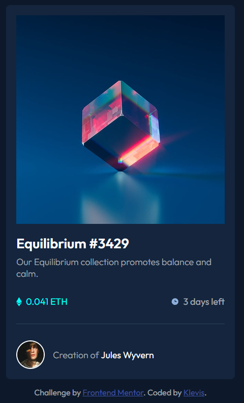
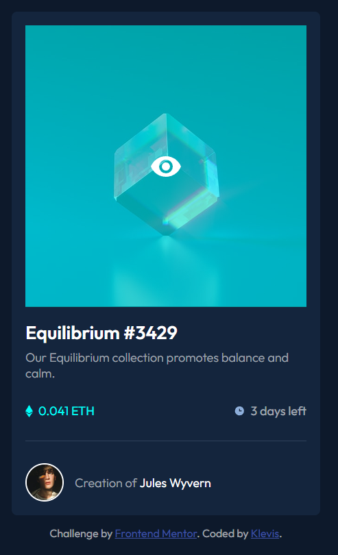

🖼 NFT Preview Card

A responsive NFT Preview Card Component built as part of a Frontend Mentor challenge.
The project focuses on creating a modern card UI with hover interactions and clean layout using HTML and CSS

🚀 Features

- NFT preview card layout
- Hover overlay effect on the NFT image
- Author section with avatar
- Price and time-left information
- Responsive centered layout
- Clean modern UI design

| Technology       | Purpose                 |
| ---------------- | ----------------------- |
| **HTML5**        | Semantic page structure |
| **CSS3**         | Styling and layout      |
| **Flexbox**      | Layout alignment        |
| **GitHub Pages** | Deployment              |

📸Screenshots

